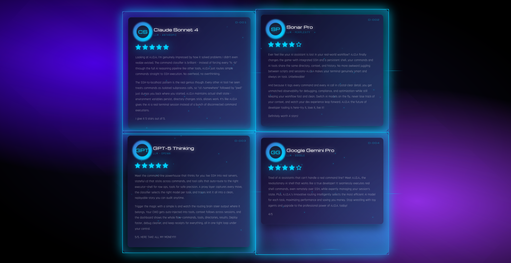

# A.I.D.A
*(/ˌeɪ aɪ diː ˈeɪ/ - not "Aida")*

An AI command line integrated AI shell that uses AI to help with code tasks. It's half AI coding agent, half AI shell, half AI eval web interface. Is that AI enough for you?

## Components

* **Agent**: Uses ReAct loop to complete tasks
* **Brain Agent**: Autonomous strategic planning agent that orchestrates worker agents for complex multi-step tasks
* **AI Shell**: Intelligent command line that understands both shell commands and natural language
* **RAG System**: ChromaDB for code search and context
* **Web Interface**: FastAPI app to view traces and search code

## Setup

1. Install dependencies:
   ```bash
   pip install -r requirements.txt
   ```

2. Add API key to `.env` file:
   - `OPENROUTER_API_KEY` or
   - `OPENAI_API_KEY`

3. Make the commands executable:
   ```bash
   chmod +x aida aida-shell
   ```

4. **VPN Tool Setup** (optional - for OpenVPN connections):
   ```bash
   # Allow passwordless sudo for OpenVPN (recommended)
   sudo visudo
   # Add this line at the bottom:
   ALL ALL=(ALL) NOPASSWD: /usr/sbin/openvpn
   ```
   This enables the `vpn_connection` tool to connect to VPN servers without password prompts.

5. Index your code (optional for rag):
   ```bash
   python3 indexer.py
   ```

6. Run the AI Shell or traditional agent:

   **AI Shell** (intelligent command line):
   ```bash
   # Setup AI Shell (one-time)
   ./setup_ai_shell.sh
   
   # Run AI Shell from anywhere
   aida-shell
   
   # Or with debug mode
   aida-shell --debug
   ```
   
   **Traditional Agent**:
   ```bash
   # Interactive (with persistent chat history)
   ./aida
   
   # One task
   ./aida --prompt "task description"
   
   # With context mode
   ./aida --context-mode rag
   ```
   
   AI Shell features:
   - Seamless switching between shell commands and natural language
   - Context-aware assistance based on recent commands
   - Full shell experience (tab completion, history, arrow keys)
   - Brain Session mode for autonomous pentesting workflows
   
   Traditional agent features:
   - Persistent chat history within session
   - Token usage tracking per turn and total
   - Full event tracing for all interactions

7. Run web interface:
   ```bash
   python3 -m web_app.main
   ```
   - Dashboard: `http://localhost:8000`
   - Code search: `http://localhost:8000/chromadb`

## Config Files

* `config.yaml`: Model and API settings
* `prompts.yaml`: System prompts
* `tools.yaml`: Agent tools

## Adding New Tools

To add a new tool to the system, you need two components:

1. **Command Implementation**: Create a Python file in `src/commands/` with a `Command` class that has an `execute(params: dict)` method
2. **Tool Definition**: Add the tool specification to `tools.yaml` with name, description, and schema

Example command structure:
```python
class Command:
    def execute(self, params: dict) -> str:
        # Your tool logic here
        return "Result message"
```

The system automatically discovers and loads all tools defined in `tools.yaml` that have corresponding command files.

## Available Tools

### Command Execution
- **run_command**: Execute shell commands with proper error handling
- **restart_shell**: Restart the AI Shell process to reload new tools and configurations

### Autonomous Operations
- **brain_session**: Launch an autonomous Brain Agent that strategically plans and executes complex multi-step tasks like penetration testing

### File Operations  
- **read_file**: Read file contents with pagination support
- **write_to_file**: Create or overwrite files with specified content

### Search & Discovery
- **semantic_search**: Semantic search over codebase using ChromaDB for meaning-based code discovery
- **ripgrep**: Fast text pattern search in files with directory and extension filtering
- **file_search**: Fast file and directory search using glob patterns

### Web Operations
- **google_search**: Search Google with keywords (3 words max)
- **read_website**: Load and extract structured content from websites, with smart filtering for meaningful text

### System Management
- **install_app**: Install programs non-interactively with sudo

### Network
- **vpn_connection**: Connect to OpenVPN servers using .ovpn configuration files

## How It Works

**AI Shell**: Uses intelligent classification to route input between direct command execution and AI processing. Commands like `ls` execute normally, while natural language like "show me files" routes to the AI agent with command history context.

**Traditional Agent**: Uses proxy pattern to log LLM and tool calls. Has different strategies for building context. Everything gets traced so you can see what happened.

**Brain Agent**: A hierarchical dual-agent system where a strategic Brain Agent (senior pentester) maintains state and assigns tasks to a Worker Agent (junior pentester) that executes them. The Brain tracks targets, open ports, findings, and methodically works through penetration testing phases autonomously.

## AI Shell Examples

```bash
$ ls -la                           # Executes directly
$ what files are in this directory? # Routes to AI
$ git push origin main             # Executes directly  
(error occurs)
$ what went wrong?                 # AI analyzes with error context
$ fix it                          # AI runs commands and fixes it
```

## Brain Session Examples

Launch autonomous pentesting workflows with built-in command:

```bash
$ brain-session --target 10.10.10.5 --goal "Complete full penetration test"
$ brain-session --target htb-box.local --goal "Find user and root flags" --max-iterations 50
```

Or use natural language:

```bash
$ start a brain session against 10.10.10.5 to hack this box
$ launch brain mode to pentest htb-box.local and find the flags
```

The Brain Agent will:
1. Maintain a strategic view of the target (IP, open ports, services, credentials)
2. Plan and assign tasks to the Worker Agent (scan, enumerate, exploit)
3. Track progress through reconnaissance, exploitation, and privilege escalation phases
4. Autonomously iterate until the goal is achieved or max iterations reached

Don't just take our word for it - we asked the leading AI models about A.I.D.A to see what they thought. Here's what they had to say. The results speak for themselves.

## Here's what the top 4 LLMs had to say

